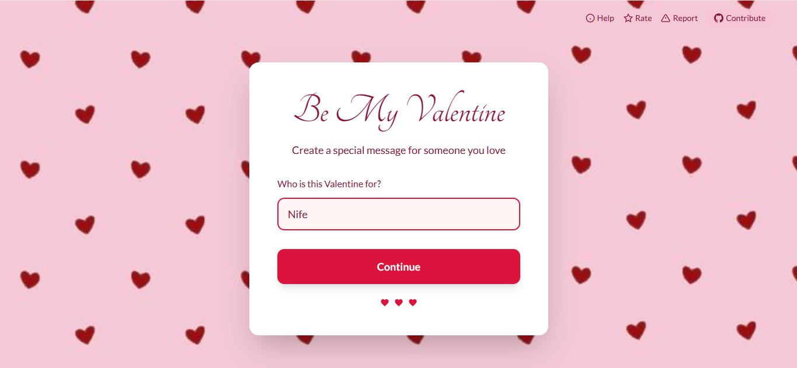
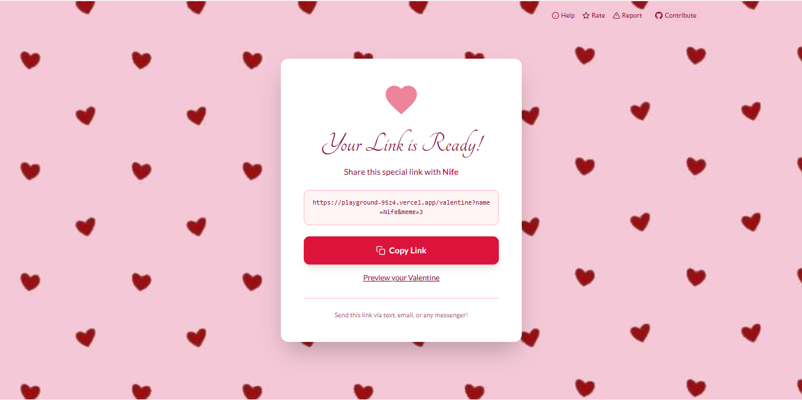

# Ask Your Valentine˚ʚ♡ɞ˚
⠀⠀⠀⠀⠀⠀⠀⠀⠀⠀
A cutesy Valentine's Day message generator where you can create personalized "Will you be my Valentine?" experiences with adorable Milk & Mocha reactions ♡

**Live Link:** [playground-95z4.vercel.app](https://playground-95z4.vercel.app/)

  /)/)
( . .)
( づ♡


---

## About This Project˚ʚ♡ɞ˚

I made this because I wanted to spread some love to my girls ♡ 

**Dedicated to:**
- Halima
- Bukky
- Faith 
- Aysha 
- [@Alessa](https://github.com/dpwalessa) (if you're reading this hiii babyyyyy!)
- My sister Fifi ♡

.𖥔 ݁ ˖. ݁₊ ⊹ . ݁˖ . ๋࣭݁ ⭑⚝


---

## ✿ How It Works

**Step 1:** Enter your valentine's name


**Step 2:** Pick your favorite Milk & Mocha reaction


**Step 3:** Get your shareable link


**Step 4:** They receive the cutest proposal ever!


The "No" button shrinks and changes text with the text.
When they finally click "Yes"... falling hearts and your chosen Milk & Mocha celebration ♡

---

## Tech Stack

୨ৎ Built with love using:

- Next.js 15
- TypeScript
- Tailwind CSS
- Firebase (for reports & ratings)
- Vercel (deployment)

---

## Features

˚ʚ♡ɞ˚

- Personalized Valentine messages
- 6 adorable Milk & Mocha GIF reactions
- Shrinking "No" button with funny Igbo phrases
- Endless falling hearts animation
- Mobile responsive
- Rate & Report functionality
- Open source contributions welcome

---

## Run Locally
```bash
# Clone the repo
git clone https://github.com/nife-codes/playground.git

# Navigate to project
cd playground/ask-your-val

# Install dependencies
npm install

# Create .env.local and add your Firebase config
cp .env.example .env.local

# Run development server
npm run dev
```

Open [http://localhost:3000](http://localhost:3000) ♡

---

## Contributing

.𖥔 ݁ ˖. ݁₊ ⊹

Want to make this even cuter? PRs are welcome! Check out the main [playground repo](https://github.com/nife-codes/playground) to contribute.

---


```
⠀⠀⠀⠀⠀⠀⠀⠀⠀:¨ ·.· ¨:
⠀⠀⠀⠀⠀⠀⠀⠀⠀⠀`· . 𐙚  ୨ৎ
```

---


⠀⠀⠀⠀⠀⠀⠀⠀⢀⡀⠀⠀⠀⠀⠀⠀⠀⠀⠀⠀⠀⠀⠀⠀⠀⠀⠀⠀⠀⠀⠀⠀
⠀⠀⠀⠀⠀⠀⠀⢤⣺⡟⠋⠀⠀⠀⠀⠀⠀⠀⠀⠀⠀⠀⠀⠀⠀⠀⠀⠀⠀⠀⠀⠀
⠀⠀⠀⠀⠀⠀⠀⠀⠈⡅⠀⠀⠀⠀⠀⠀⠀⠀⠀⠀⠀⠀⠀⠀⠀⠀⠀⠀⠀⠀⠀⠀
⠀⠀⠀⠀⠀⠀⠀⠀⠀⠀⠀⠀⠀⠀⠀⠀⠀⠀⠀⠀⠀⠀⠀⠀⠀⣶⣄⡀⠀⠀⠀⠀
⠀⠀⠀⠀⠀⠀⠀⣀⣀⠀⠀⢀⣀⣀⣀⡀⠀⠀⠀⠀⠀⠀⠀⠀⠈⡿⠃⠀⠀⠀⠀⠀
⠀⠀⠀⠀⠀⠀⣼⠋⠻⢿⣤⢿⠏⠀⠉⣟⡀⠀⠀⠀⠀⠀⠀⠀⠀⠀⠀⠀⠀⠀⠀⠀
⠀⠀⠀⠀⠀⠀⣿⡄⠀⠀⠁⠀⠀⠀⢀⣿⠇⠀⠀⠀⠀⠀⠀⠀⠀⠀⠀⠀⠀⠀⠀⠀
⠀⠀⠀⠀⠀⠀⠸⣧⠀⠀⠀⠀⠀⣄⡾⠃⠀⠀⠀⠀⠀⠀⠀⠀⠀⠀⠀⠀⠀⠀⠀⠀
⠀⡂⠀⠀⠀⠀⠀⠐⣷⢀⣀⣴⡿⠏⠀⠀⠀⠀⠀⠀⠀⠀⠀⠀⣀⣤⡤⡄⠀⠀⠀⠀
⣤⣧⡤⠀⠀⠀⠀⠀⠀⠘⠘⠁⠀⠀⠀⠀⠀⠀⠀⠀⠀⠀⢼⣿⠋⠉⡇⣇⣤⣤⣤⡀
⠀⢲⠀⠀⠀⠀⠀⠀⠀⠀⠀⠀⠀⠀⠀⠀⠀⠀⠀⠀⠀⠘⢻⡇⠀⠀⣷⡟⠁⠀⢸⡇
⠀⠀⠀⠀⠀⠀⠀⠀⠀⠀⠀⠀⠀⠀⠀⠀⠀⠀⠀⠀⠀⠀⢸⡇⠀⠐⠃⠀⠀⢀⣼⠇
⠀⠀⠀⠀⠀⠀⢠⡶⢢⠀⠀⠀⠀⠀⠀⠀⡀⠀⠀⠀⠀⠀⢸⡇⠀⣀⣤⣤⣶⠧⠃⠀
⠀⠀⠀⢠⡖⠲⣿⠁⣸⠇⠀⠀⠀⠀⠀⡠⣧⠆⠀⠀⠀⠀⠈⠛⠳⠕⠛⠁⠀⠀⠀⠀
⠀⠀⠀⠐⠿⡤⢤⣠⡿⠀⠀⠀⠀⠀⠀⠀⠛⠀⠀⠀⠀⠀⠀⠀⠀⠀⠀⠀⠀⠀⠀⠀
